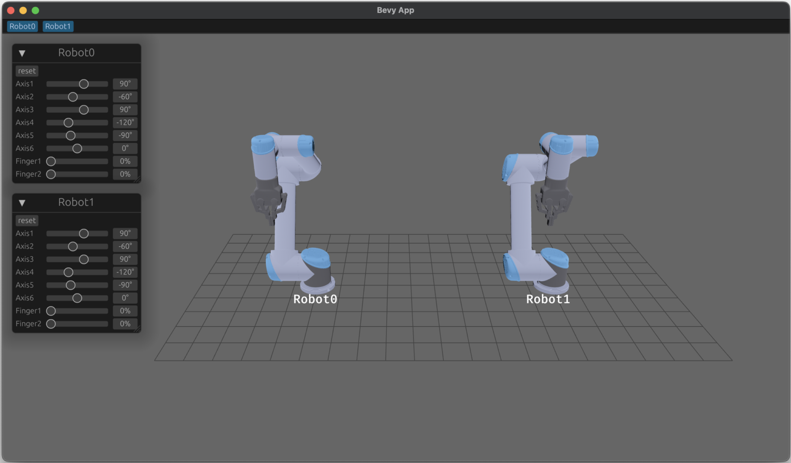
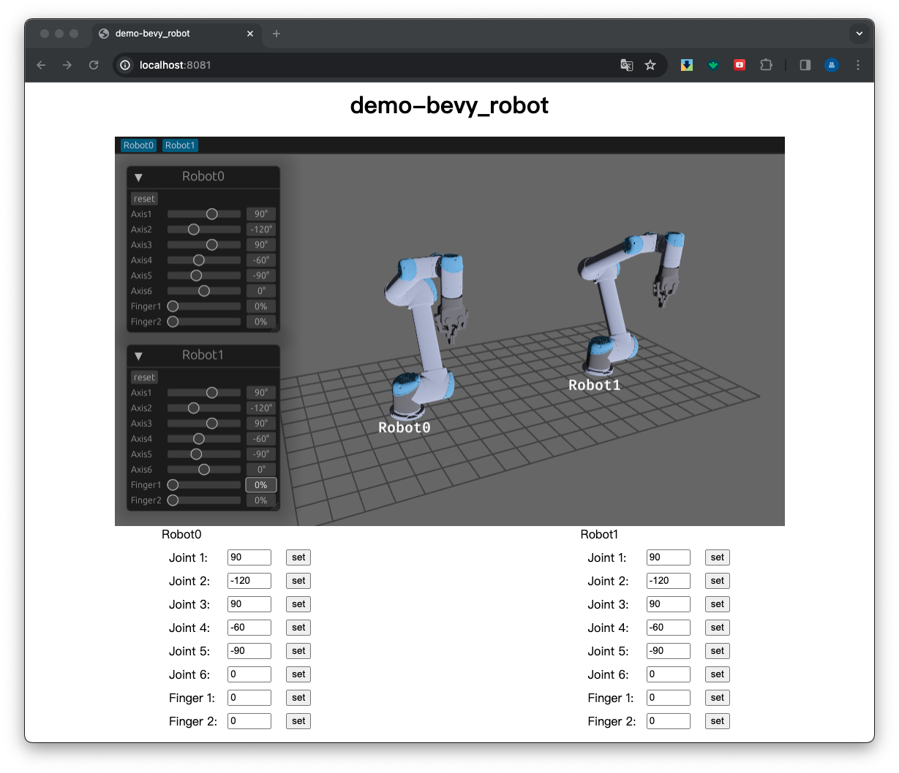

# demo-bevy_robot
Display UR5 robots using the bevy engine





## native application

### build

Run cmd
```shell
cargo build --release
```

### run

Run cmd
```shell
cargo run --release
```

## single page web application

### build

Compile to wasm, refer to [trunk](https://trunkrs.dev/). the generated files are in the path "./dist". 
 ```shell
 trunk build --release
 ```
   
### run

use [static-web-server](https://static-web-server.net/) or others web-server.

 ```shell
 static-web-server -p 8080 --root ./dist/
 ```
